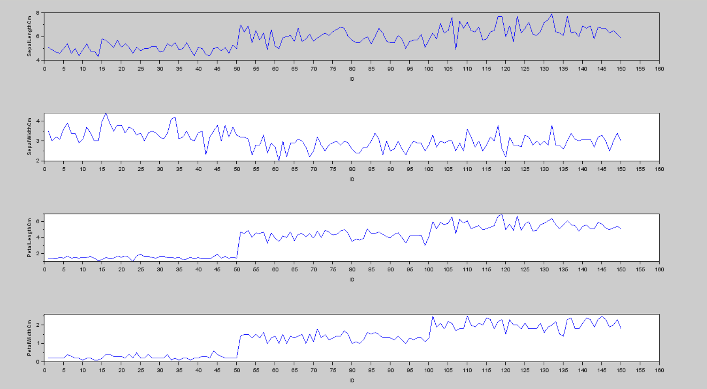
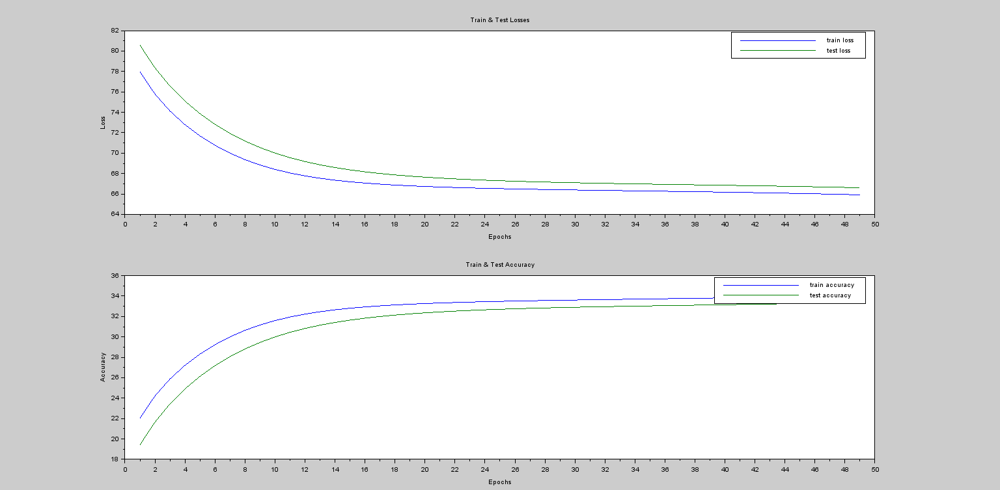
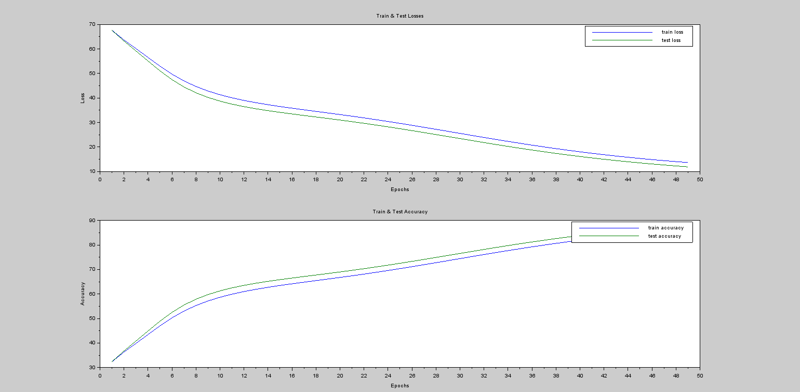
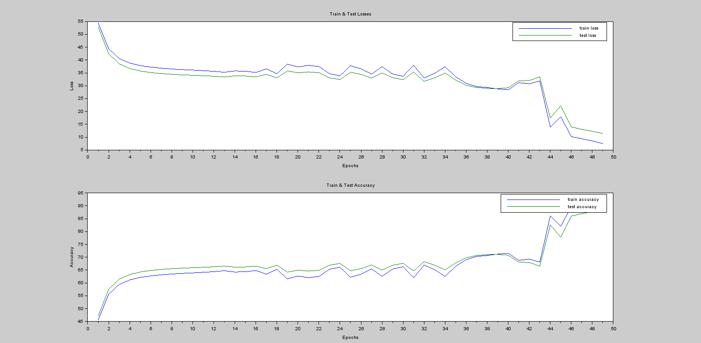

# Lab-3

### Load data

## Exercise 1: 
Download and Study both (PIMA-INDIAN-DIABETES, IRIS) dataset files from the LMS

● Observe and comment about the features/values of dataset.

      --> data = csvRead('pima-indians-diabetes.csv');
      --> number_of_time_pregnant = data(:,1);
      --> glucose = data(:,2);
      -->  blood_pressure = data(:,3);
      --> Triceps_skin_fold_thickness = data(:,4);
      --> serum_insulin = data(:,5);
      --> Body_mass_index = data(:,6);
      --> Diabetes_pedigree = data(:,7);
      --> Age = data(:,8);
      --> class_output = data(:,9);

● Iris_dataset One Hot Encoding

      xlabel('ID');
      ylabel('SepalLengthCm');
      subplot(4,1,2);plot(ID,SepalWidthCm);
      xlabel('ID');
      ylabel('SepalWidthCm');
      subplot(4,1,3);plot(ID,PetalLengthCm);
      xlabel('ID');
      ylabel('PetalLengthCm');
      subplot(4,1,4);plot(ID,PetalWidthCm);
      xlabel('ID');
      ylabel('PetalWidthCm');

      Iris_setosa = zeros(length(ID),1);
      Iris_versicolor = zeros(length(ID),1);
      Iris_virginica = zeros(length(ID),1);

      for i=1:length(ID)
          if Species(i) == 'Iris-setosa'
              Iris_setosa(i) = 1;
          end
          if Species(i) == 'Iris-versicolor'
              Iris_versicolor(i) = 1;
          end
          if Species(i) == 'Iris-virginica'
              Iris_virginica(i) = 1;
          end
      end

      M = [ID,SepalLengthCm,SepalWidthCm,PetalLengthCm,PetalWidthCm,Iris_setosa,Iris_versicolor,Iris_virginica]
      csvWrite(M,'One-Hot-Encoding_Iris.csv',',');
     
   

## Exercise 2: 
Implement an ANN feed-forward network and evaluate its Accuracy for Pima-Indian-Diabetes dataset. 

● Tweak parameters to improve accuracy (like learning rate and training cycles ). Report the output accuracy.

## Exercise 3: 
Implement an ANN feed-forward backpropagation network and evaluate its Accuracy for Iris Dataset.

● Tweak parameters to improve accuracy (like learning rate , minimum Error and training cycles ). Calculate and print the mean accuracy.

            data = csvRead('Iris_and_pima-Indian-diabetes_dataset\Iris.csv',[],[],'string');
            ID = strtod(data(:,1));
            SepalLengthCm = strtod(data(:,2));
            SepalWidthCm =  strtod(data(:,3));
            PetalLengthCm = strtod(data(:,4));
            PetalWidthCm = strtod(data(:,5));
            Species = data(:,6);

            Iris_setosa = zeros(length(ID),1);
            Iris_versicolor = zeros(length(ID),1);
            Iris_virginica = zeros(length(ID),1);

            for i=1:length(ID)
                if Species(i) == 'Iris-setosa'
                    Iris_setosa(i) = 1;
                end
                if Species(i) == 'Iris-versicolor'
                    Iris_versicolor(i) = 1;
                end
                if Species(i) == 'Iris-virginica'
                    Iris_virginica(i) = 1;
                end
            end

            M = [ID,SepalLengthCm,SepalWidthCm,PetalLengthCm,PetalWidthCm,Iris_setosa,Iris_versicolor,Iris_virginica]
            csvWrite(M,'One-Hot-Encoding_Iris.csv',',');

            data = csvRead('One-Hot-Encoding_Iris.csv',[],[],'string');
            ID = strtod(data(:,1));
            SepalLengthCm = strtod(data(:,2));
            SepalWidthCm =  strtod(data(:,3));
            PetalLengthCm = strtod(data(:,4));
            PetalWidthCm = strtod(data(:,5));

            Iris_setosa = strtod(data(:,6));
            Iris_versicolor = strtod(data(:,7));
            Iris_virginica = strtod(data(:,8));

            x = [SepalLengthCm(2:151) SepalWidthCm(2:151) PetalLengthCm(2:151) PetalWidthCm(2:151)]
            y = [Iris_setosa(2:151) Iris_versicolor(2:151) Iris_virginica(2:151)]

            [x,y] = ann_pat_shuffle(x',y');
            x = x';
            y = y';
            train_x = x(1:105,:)
            test_x = x(106:150,:)
            train_y = y(1:105,:)
            test_y = y(106:150,:)

            disp("Number of Iris_setosa in test dataset : ");
            disp(sum(train_y(:,1),'r'));
            disp("Number of Iris_versicolor in test dataset : ");
            disp(sum(train_y(:,2),'r'));
            disp("Number of Iris_virginica in test dataset : ");
            disp(sum(train_y(:,3),'r'));

            train_losses = []
            test_losses = []

            train_accuracies = []
            test_accuracies = []

            N = [4 4 3];
            W = ann_FF_init(N);
            learning_parameters = [0.08,0];
            t = 1;
            T = 50;

            f = figure(1)
            f.figure_size=[2000,2000];
            while t<T
                    W = ann_FF_Std_online(train_x',train_y',N,W,learning_parameters,1);

                    y_test_predicted = ann_FF_run(test_x',N,W);
                    err_test = ann_d_sum_of_sqr(y_test_predicted',test_y);
                    test_loss = sum(err_test.*err_test)/size(test_y)(1)*100;
                    test_acc = 100-test_loss;

                    y_train_predicted =  ann_FF_run(train_x',N,W);
                    err_train = ann_d_sum_of_sqr(y_train_predicted',train_y);
                    train_loss = sum(err_train.*err_train)/size(train_y)(1)*100;
                    train_acc = 100-train_loss;

                    train_losses = [train_losses train_loss]
                    test_losses = [test_losses test_loss]
                    train_accuracies = [train_accuracies train_acc]
                    test_accuracies = [test_accuracies test_acc]
                    if t>=2 then
                        clf(1);
                        subplot(2,1,1);
                        plot((1:t)',[train_losses;test_losses]')
                        //plot(1:t,test_losses,c='b')
                        xlabel('Epochs')
                        ylabel('Loss')
                        title('Train & Test Losses')
                        hl=legend(['train loss';'test loss']');
                        subplot(2,1,2);
                        plot((1:t)',[train_accuracies;test_accuracies]')
                        //plot(1:t,test_accuracies,c='b')
                        xlabel('Epochs')
                        ylabel('Accuracy')
                        title('Train & Test Accuracy')
                        ha=legend(['train accuracy';'test accuracy']');
                    end
                    if test_accuracy >= 0.95
                        break
                    end
                    t=t+1;
            end

### output
#### LR = 0.01

#### LR = 0.08

#### LR = 0.5

## Exercise 4: 
Visit [http://playground.tensorflow.org](http://playground.tensorflow.org) and create your own ANN for classifying Non-linear pattern.

● Change the parameters and observe their impact on execution.
