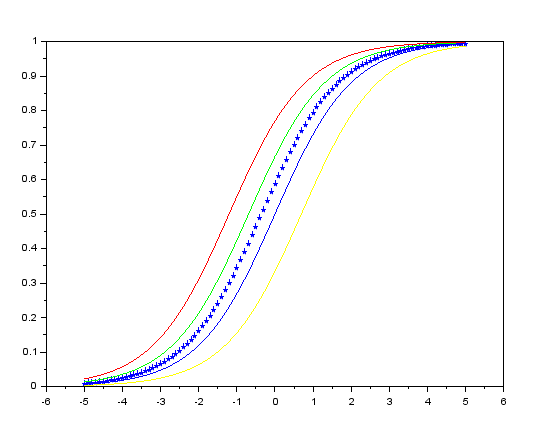
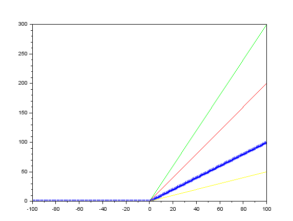
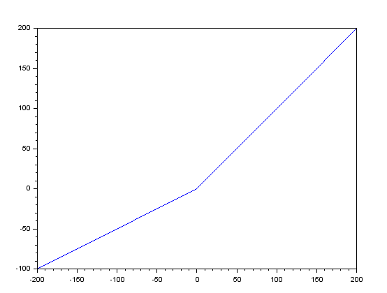
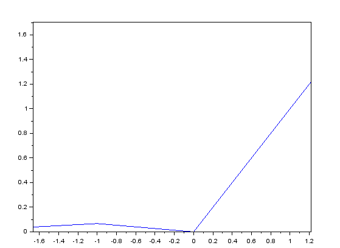
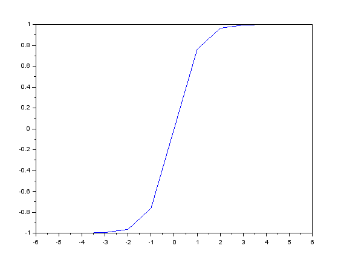

# introduction to scilab

## Sigmoid

    alpha = .7
    x=-5:.1:5
    y= 1./(1+alpha*exp(-x));
    plot(x,y,"p");
  
  
  
## Rectified Linear Unit

    alpha = 2
    x=-100:1:100;
    y=max(0,alpha*x);
    plot(x,y,"r");
    

## Leaky Relu
 
    alpha = 0.5;
    x=-200:200;

    for i=1:401;
        if x(i)<0 then
            y(i) = alpha.*x(i);
        else
            y(i)=x(i);
        end
    end
    plot(x,y);

## Exponential Linear Unit
    
    alpha = 0.5;
    x=-20:400;

    for i=1:421;
        if x(i)<0 then
            y(i) = alpha*(exp(x(i)-1));
        else
            y(i)=x(i);
        end
    end
    plot(x,y);

## Tanh

    alpha = 0.5;
    x=-200:200;

    for i=1:401;
        if x(i)<0 then
            y(i) = alpha.*x(i);
        else
            y(i)=x(i);
        end
    end
    plot(x,y);
    

