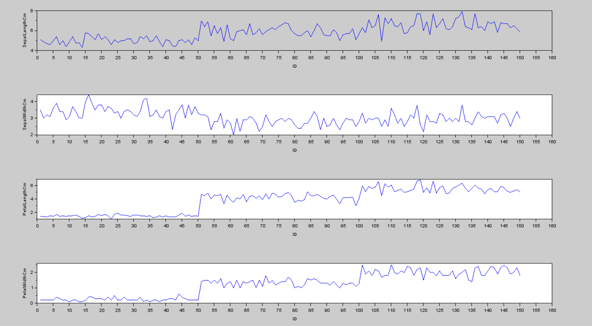

# Lab-3

### Load data

## Exercise 1: 
Download and Study both (PIMA-INDIAN-DIABETES, IRIS) dataset files from the LMS

● Observe and comment about the features/values of dataset.

      --> data = csvRead('pima-indians-diabetes.csv');
      --> number_of_time_pregnant = data(:,1);
      --> glucose = data(:,2);
      -->  blood_pressure = data(:,3);
      --> Triceps_skin_fold_thickness = data(:,4);
      --> serum_insulin = data(:,5);
      --> Body_mass_index = data(:,6);
      --> Diabetes_pedigree = data(:,7);
      --> Age = data(:,8);
      --> class_output = data(:,9);

● Iris_dataset One Hot Encoding

      xlabel('ID');
      ylabel('SepalLengthCm');
      subplot(4,1,2);plot(ID,SepalWidthCm);
      xlabel('ID');
      ylabel('SepalWidthCm');
      subplot(4,1,3);plot(ID,PetalLengthCm);
      xlabel('ID');
      ylabel('PetalLengthCm');
      subplot(4,1,4);plot(ID,PetalWidthCm);
      xlabel('ID');
      ylabel('PetalWidthCm');

      Iris_setosa = zeros(length(ID),1);
      Iris_versicolor = zeros(length(ID),1);
      Iris_virginica = zeros(length(ID),1);

      for i=1:length(ID)
          if Species(i) == 'Iris-setosa'
              Iris_setosa(i) = 1;
          end
          if Species(i) == 'Iris-versicolor'
              Iris_versicolor(i) = 1;
          end
          if Species(i) == 'Iris-virginica'
              Iris_virginica(i) = 1;
          end
      end

      M = [ID,SepalLengthCm,SepalWidthCm,PetalLengthCm,PetalWidthCm,Iris_setosa,Iris_versicolor,Iris_virginica]
      csvWrite(M,'One-Hot-Encoding_Iris.csv',',');
     
   

## Exercise 2: 
Implement an ANN feed-forward network and evaluate its Accuracy for Pima-Indian-Diabetes dataset. 

● Tweak parameters to improve accuracy (like learning rate and training cycles ). Report the output accuracy.
## Exercise 3: 
Implement an ANN feed-forward backpropagation network and evaluate its Accuracy for Iris Dataset.

● Tweak parameters to improve accuracy (like learning rate , minimum Error and training cycles ). Calculate and print the mean accuracy.

## Exercise 4: 
Visit [http://playground.tensorflow.org](http://playground.tensorflow.org) and create your own ANN for classifying Non-linear pattern.

● Change the parameters and observe their impact on execution.
