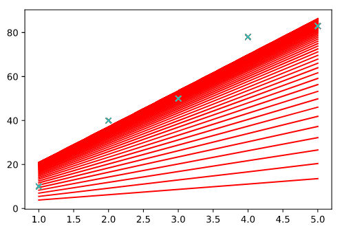
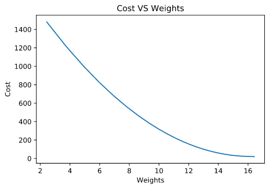
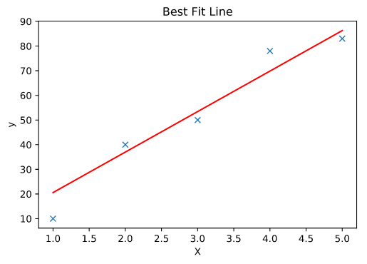

# LINEAR REGRESSION USING GRADIENT DESCENT
## Code
        import numpy as np
        from matplotlib import pylab as plt
        import time

        X = np.array([[1,2,3,4,5]],dtype=float).transpose()
        y = np.array([[10,40,50,78,83]],dtype=float).transpose()

        bias = np.ones(shape=(len(X),1))
        X = np.concatenate([bias,X],axis=1)

        number_of_points = np.shape(X)[0]
        epoch = 100
        learning_rate = 0.008
        weights = np.ones((np.shape(X)[1],1))

        print("X Shape : ",X.shape)
        print("Y Shape : ",y.shape)
        print("Weight shape : ",weights.shape)

        def GradientDescent(X,y,weights,learning_rate,number_of_points,epoch):
            cost_values = []
            weights_value = []
            for i in range(epoch):
                hypothesis = np.dot(X,weights)
                loss = hypothesis - y
                cost = np.dot(loss.transpose(),loss)/(2*number_of_points)
                cost_values.append(cost[0][0])
                print("epoch : {} Cost : {}".format(i,cost[0][0]))
                gradient = np.dot(X.transpose(),loss)/number_of_points
                weights -= learning_rate*gradient
                weights_value.append(weights[1][0])
                plt.figure(2)
                plt.plot(X[:,1],y,'x')
                plt.plot(X[:,1],np.dot(X,weights),'r-')
            return weights,cost_values,weights_value

        weights,cost_values,weights_value = GradientDescent(X,y,weights,learning_rate,number_of_points,epoch)

        #  Best Fit Line
        plt.figure(2)
        plt.plot(X[:,1],y,'x')
        plt.plot(X[:,1],np.dot(X,weights),'r-')
        plt.xlabel("X")
        plt.ylabel("y")
        plt.title("Best Fit Line")

        #  Cost Function VS Weights
        plt.plot(weights_value,cost_values)
        plt.xlabel("Weights")
        plt.ylabel("Cost")
        plt.title("Cost VS Weights")
        plt.show()

### Output
      epoch : 0 Cost : 1480.7
      epoch : 1 Cost : 1217.70267776
      epoch : 2 Cost : 1002.1305874332877
      epoch : 3 Cost : 825.4312100861983
      epoch : 4 Cost : 680.5943628774307
      epoch : 5 Cost : 561.8740587028127
      epoch : 6 Cost : 464.5605248537946
      epoch : 7 Cost : 384.79333516063366
      epoch : 8 Cost : 319.4082413353498
      epoch : 9 Cost : 265.81162629986164
      epoch : 10 Cost : 221.87759823172684
      epoch : 11 Cost : 185.86364236705495
      epoch : 12 Cost : 156.34148390923642
      epoch : 13 Cost : 132.14041891739691
      epoch : 14 Cost : 112.30086473577865
      epoch : 15 Cost : 96.03628700209165
      epoch : 16 Cost : 82.70199262721529
      epoch : 17 Cost : 71.76955055716898
      epoch : 18 Cost : 62.805825419646986
      epoch : 19 Cost : 55.45579218108088
      epoch : 20 Cost : 49.428449957908754
      epoch : 21 Cost : 44.48527608969718
      epoch : 22 Cost : 40.430762370761876
      epoch : 23 Cost : 37.10465794994791
      epoch : 24 Cost : 34.3756111230512
      epoch : 25 Cost : 32.13595774569724
      epoch : 26 Cost : 30.297449488514918
      epoch : 27 Cost : 28.78775244621041
      epoch : 28 Cost : 27.547577177183275
      epoch : 29 Cost : 26.52832630335888
      epoch : 30 Cost : 25.690166334948636
      epoch : 31 Cost : 25.000447216662913
      epoch : 32 Cost : 24.43240688831179
      epoch : 33 Cost : 23.96410946113744
      epoch : 34 Cost : 23.57757488030429
      epoch : 35 Cost : 23.25806554149576
      epoch : 36 Cost : 22.993501556976184
      epoch : 37 Cost : 22.77398147085132
      epoch : 38 Cost : 22.59138940712917
      epoch : 39 Cost : 22.43907306354424
      epoch : 40 Cost : 22.311579775028303
      epoch : 41 Cost : 22.204440174718474
      epoch : 42 Cost : 22.11399086890307
      epoch : 43 Cost : 22.03722909024572
      epoch : 44 Cost : 21.971693562419773
      epoch : 45 Cost : 21.91536684926394
      epoch : 46 Cost : 21.866595314003806
      epoch : 47 Cost : 21.8240235127921
      epoch : 48 Cost : 21.7865404195244
      epoch : 49 Cost : 21.753235348313815
      epoch : 50 Cost : 21.72336182477637
      epoch : 51 Cost : 21.69630797266268
      epoch : 52 Cost : 21.67157224087711
      epoch : 53 Cost : 21.648743507814874
      epoch : 54 Cost : 21.627484773624257
      epoch : 55 Cost : 21.607519793358193
      epoch : 56 Cost : 21.58862212066392
      epoch : 57 Cost : 21.570606127301126
      epoch : 58 Cost : 21.553319642173786
      epoch : 59 Cost : 21.536637917817234
      epoch : 60 Cost : 21.520458684950945
      epoch : 61 Cost : 21.504698098878645
      epoch : 62 Cost : 21.489287416902663
      epoch : 63 Cost : 21.474170274923303
      epoch : 64 Cost : 21.45930045516834
      epoch : 65 Cost : 21.444640056483326
      epoch : 66 Cost : 21.430157994586274
      epoch : 67 Cost : 21.41582877278184
      epoch : 68 Cost : 21.40163147436131
      epoch : 69 Cost : 21.38754893670988
      epoch : 70 Cost : 21.37356707435295
      epoch : 71 Cost : 21.359674324082192
      epoch : 72 Cost : 21.345861190145705
      epoch : 73 Cost : 21.332119871457177
      epoch : 74 Cost : 21.318443956032947
      epoch : 75 Cost : 21.304828170533177
      epoch : 76 Cost : 21.291268174969936
      epoch : 77 Cost : 21.277760394436996
      epoch : 78 Cost : 21.264301881184604
      epoch : 79 Cost : 21.25089020156749
      epoch : 80 Cost : 21.23752334337993
      epoch : 81 Cost : 21.22419963990172
      epoch : 82 Cost : 21.210917707641308
      epoch : 83 Cost : 21.197676395306154
      epoch : 84 Cost : 21.184474741975315
      epoch : 85 Cost : 21.171311942815002
      epoch : 86 Cost : 21.1581873209768
      epoch : 87 Cost : 21.14510030456355
      epoch : 88 Cost : 21.132050407748988
      epoch : 89 Cost : 21.119037215302058
      epoch : 90 Cost : 21.106060369902043
      epoch : 91 Cost : 21.093119561740966
      epoch : 92 Cost : 21.080214520001167
      epoch : 93 Cost : 21.06734500586935
      epoch : 94 Cost : 21.054510806810686
      epoch : 95 Cost : 21.041711731875065
      epoch : 96 Cost : 21.028947607849936
      epoch : 97 Cost : 21.016218276106663
      epoch : 98 Cost : 21.003523590015455
      epoch : 99 Cost : 20.990863412826535
      
 
 
 
