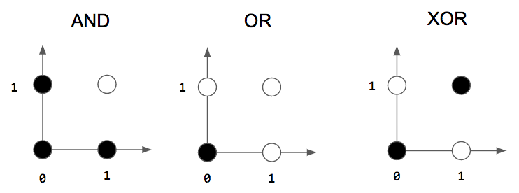
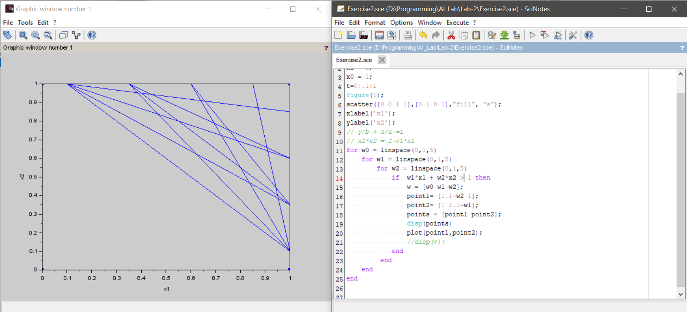
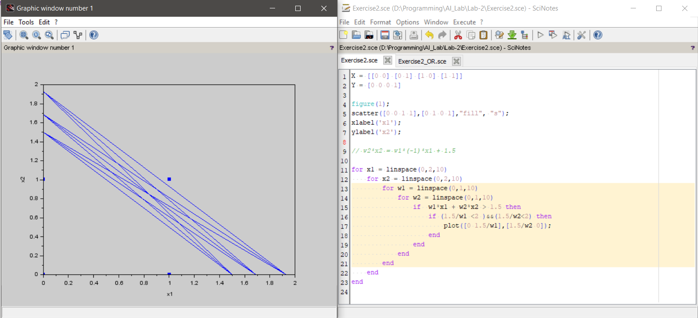
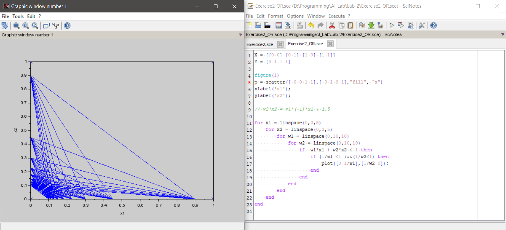
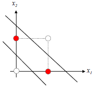

#  Implementing basic Logic functions using Single Neuron Model

1) rosen blatt Neuron
2) weights represents importance of input
3) perceptron (i.e. simple neural network)

# Exercise I
Let w1 and w2 be the weights of a perceptron (i.e. simple neural network) with two inputs x1
and x2. Let AND(x1, x2) be the "logical and" function, let OR(x1, x2) be the "logical or" 
function and let NOT(x) be the logical NOT function.
Plot constellation diagram for these logic gates. Are the data points linearly separable? If 
yes, what is its significance with respect to perceptron?

# Exercise II
Design three single-neuron models which correspond to the logical AND, OR and NOT 
functions respectively. Assume threshold activation function at the output of the Neuron.

      x1 = input('Enter Value of x1 : ');
      x2 = input('Enter Value of x2 : ');
      x0 = 1;
      t=0:.1:1
      figure(1);
      scatter([0 0 1 1],[0 1 0 1],"fill", "s");
      for w0 = linspace(0,1,10)
          for w1 = linspace(0,1,10)
              for w2 = linspace(0,1,10)
                  if w0*x0 + w1*x1 + w2*x2 >= 1 then
                      w = [w0 w1 w2];
                      y = w0*x0
                      disp(w);
                  end
               end
          end
      end
      
  

### 2)

      X = [[0 0] [0 1] [1 0] [1 1]]
      Y = [0 0 0 1]

      figure(1);
      scatter([0 0 1 1],[0 1 0 1],"fill", "s");
      xlabel('x1');
      ylabel('x2');

      // w2*x2 = w1*(-1)*x1 + 1.5

      for x1 = linspace(0,2,10)
          for x2 = linspace(0,2,10)
              for w1 = linspace(0,1,10)
                  for w2 = linspace(0,1,10)
                      if  w1*x1 + w2*x2 > 1.5 then
                          if (1.5/w1 <2 )&&(1.5/w2<2) then
                              plot([0 1.5/w1],[1.5/w2 0]);
                          end
                      end
                  end
              end
          end
      end
      
 
 
 
 ## OR Gate
      X = [[0 0] [0 1] [1 0] [1 1]]
      Y = [0 1 1 1]

      figure(1)
      p = scatter([ 0 0 1 1],[ 0 1 0 1],"fill", "x")
      xlabel('x1');
      ylabel('x2');

      // w2*x2 = w1*(-1)*x1 + 1.5

      for x1 = linspace(0,2,5)
          for x2 = linspace(0,2,5)
              for w1 = linspace(0,10,10)
                  for w2 = linspace(0,10,10)
                      if  w1*x1 + w2*x2 < 1 then
                          if (1/w1 <1 )&&(1/w2<1) then
                              plot([0 1/w1],[1/w2 0]);
                          end
                      end
                  end
              end
          end
      end
      
 
 
 
# Exercise III
Can we design a model that implements XOR(x1, x2) logic function with single neuron? 
Justify your answer with necessary decision graph.
### Ans
no we can't 

